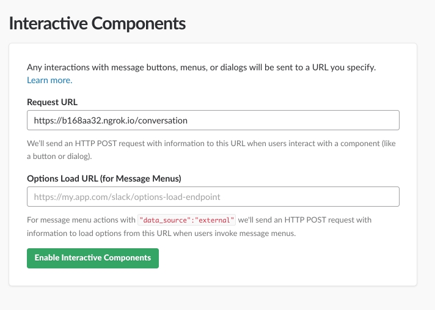
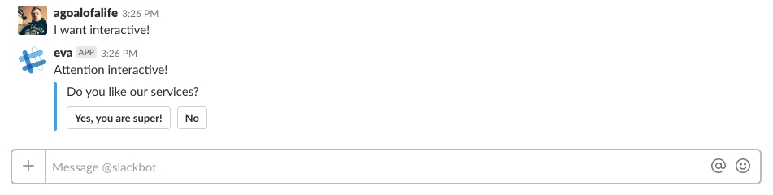

## What is Interactive?

?> _Read_ more in [documentation](https://api.slack.com/docs/message-buttons)

It's not just text messages..

It can be:
- Buttons
- Menu
- Checkbox and others

The interaction with this`'interactive'`, generates separate `https` request to server.

## Configuration

The server address specified in your application.

- In the first address field is populated, which will receive `https` requests.

- The second field is the address to a dynamic menu. That is, if initially not known to the list menu, it is possible to use request to server.




!> **Please note**, after host name is written prefix `conversation`. It is required.

## Interaction in the code

So the user started the interaction, you need to publish created interactive.

Let's send `'interactive'` after receiving the message from the chat.

```javascript
require('dotenv').config();
let token = process.env.SLACK_BOT_TOKEN;
const SlackBot = require('super-slack-bot');

const bot = new SlackBot({
    token: token,
    name: process.env.SLACK_BOT_NAME,
});

let interactiveOptions = {
    "attachments": [
        {
            "text": "Do you like our services?",
            "fallback": "Select one of the options",
            "callback_id": "like_service",
            "color": "#3AA3E3",
            "attachment_type": "default",
            "actions": [
                {
                    "name": "quality",
                    "text": "Yes, you are super!",
                    "type": "button",
                    "value": "like"
                },
                {
                    "name": "quality",
                    "text": "No",
                    "type": "button",
                    "value": "dislike"
                }
            ]
        }
    ]
};

bot.on('message.im', (route, routeMention) => {
    route(/I want interactiv!/gi, async function (response, classMessage) {
      await classMessage.reply('Attention interactive!', interactiveOptions);
    });
});
```



After sending a message, two buttons will appear where you have to make a choice. It is the pressing on these buttons will send the request to the server.


```javascript
// listen event 'conversation'
// in route we need to pass 'callback_id'
bot.on('conversation', async (route, response) => {
    // first argument callback_id
    route('like_service', function (responseInitiator, classConversation) {
      response.end('Спасибо за отзыв!');
    });
});
```
Handler how in section `commands`.
- In `route` specify `callback_id`.
- Response via `response`.