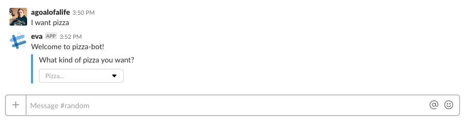

### Tutorial

In this tutorial we will touch on the highlights to create a bot, and comment on all actions.

!> **In advance** we have created the app, filled environment variables and created a bot. That is fully ready to work.

Let's create a bot for pizza.

Outline plan:
- The bot responds in any channel to the call : `['I wont pizza', 'Pizza', 'Order']` and offers an interactive menu for choosing pizza.
- The bot offers to enter the delivery address and record address.
- Command to view the status of your order.

The package we have installed, create a file `index.js` and initialize the project.

```javascript
// index.js
require('dotenv').config();
let token = process.env.SLACK_BOT_TOKEN;
const SlackBot = require('./src/BaseBot');

const bot = new SlackBot({
    token: token,
    name: process.env.SLACK_BOT_NAME,
});

```
 Now in any public channel, we catch a message which is listed above.
 
As soon as the desired event, we send an interactive menu selection of pizzas.
 
In function `route`, the first argument we pass our route is raw regular expression, you can pass a string, but then there must be strict compliance.
 
```javascript
let interactivePizzaList = {
 "response_type": "in_channel",
 "attachments": [
     {
         "text": "What kind of pizza you want?",
         "color": "#3AA3E3",
         "attachment_type": "default",
         "callback_id": "pizza_name",
         "actions": [
             {
                 "name": "pizza_list",
                 "text": "Pizza...",
                 "type": "select",
                 "options": [
                     {
                         "text": "Meat",
                         "value": "meat"
                     },
                     {
                         "text": "Cheese",
                         "value": "cheese"
                     },
                     {
                         "text": "Pepperoni",
                         "value": "pepperoni"
                     },
                     {
                         "text": "Four cheese",
                         "value": "four_cheese"
                     },
                 ]
             }
         ]
     }
 ]
};
bot.on('message.channels', (route, routeMention) => {
    route(/I want pizza|Pizza|Order/gi, async function (response, classMessage) {
        await classMessage.reply('Welcome to pizza-bot!', interactivePizzaList);
    });
});
```
It looks like this:


Once the pizza is selected, we need to write our order in the database and send a reply with the order number.

!> This example is contrived and does not include such things as number of positions, etc. You just have to consider examples.

The database is redundant now, just write to the file.

Install repository to write to the file.
```bash
npm i nconf -s
```

```javascript
const nconf = require('nconf');
const path = require('path');
...

const db = nconf.argv().env()
    .file({
        file: path.join(__dirname, 'orders.json')
    });
```

Now we need to catch the interaction with our menu.

We will write down, who made the order, as ordered, and the date when it should be delivered.

This library is used `moment.js`.

```javascript
bot.on('conversation', async (route, response) => {
    route('pizza_name', async function (responseInitiator, classConversation) {
        // generation numner order
        let numberOrder = Math.floor(Math.random() * (100000 - 1)) + 1;
        // user
        // pizza
        // date delivery
        db.set(`${numberOrder}`, {
            'user_id' : responseInitiator.user.id,
            'pizza' : responseInitiator.actions.shift().selected_options.shift().value,
            'delivery date': moment().add(40, 'minute'),
        });
        db.save();
        response.end(`Your order number ${numberOrder}. Shipping in 40 minutes` );
    });
});
```
Adding commands for information on ordering.
Go into the app and add the command: `info-order`.

```javascript
bot.on('command', async (route, response) => {
    route('/info-order', (responseInitiator, classCommand) => {
     
        let order = db.stores.file.store[responseInitiator.text];
        let message = '';
        // If the order is found
        if (order !== undefined) {
            message += 'You ordered ' + order.pizza ;
            // Check date delivery
           // Text depending on the date
            let diff = moment().diff('2018-02-26T14:49:57.076Z', 'minute');
            if (diff <= 0) {
                message += '. Your order will be via ' + Number(Math.abs(diff)) + ' minutes.'
            } else {
                message += '. Your order was already delivered.'
            }
            response.json({
                'text':message
            });
        }
        response.json({
            'text':'The order is not found'
        });
    });
});
```

As you can see we have added a command that takes an order number and looks for it in the file.
If it is found displays information about his fate, or the order is not found.

### Recommendations

In such a small application like this, all can be placed in a single file.

But it is recommended to divide all the folders.
Example create folder `routes/react`, where will be stored the reaction.

```javascript
// routes.js
bot.on('message.channels', (route, routeMention) => {
    route(/I want pizza|Pizza|Order/gi, PizzaController.order);
});
```
For save, select the folder with `models`.

You can separately create a file-route with `conversation` and `command`.

Try to think more and good luck.